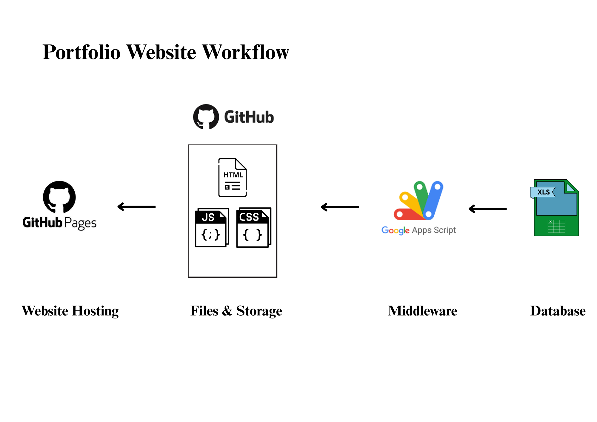

💼 Portfolio Website Project

Technologies Used: HTML, CSS, JavaScript, GitHub Pages, Google Sheets, Google Apps Script

Description:
Designed and developed a dynamic portfolio website to showcase my personal and academic projects. The website interface was built using HTML, CSS, and JavaScript, and is hosted on GitHub Pages for easy public access. To manage and update project data without editing code, I used Google Sheets as a lightweight backend.

Integrated Google Apps Script to convert the sheet data into a public JSON API. This allowed me to fetch and display the project information dynamically on the website using JavaScript. Whenever new projects are added to the sheet, the portfolio automatically reflects the updates without requiring redeployment.

